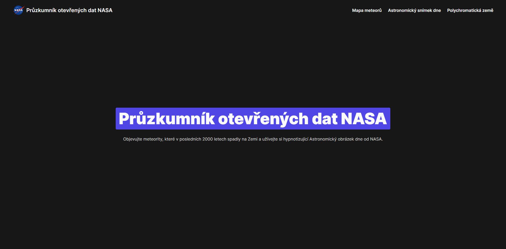
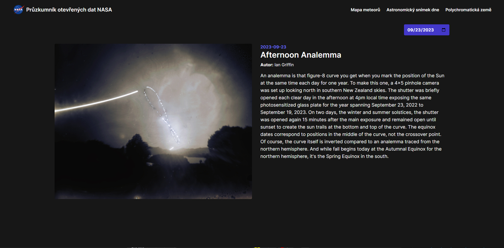
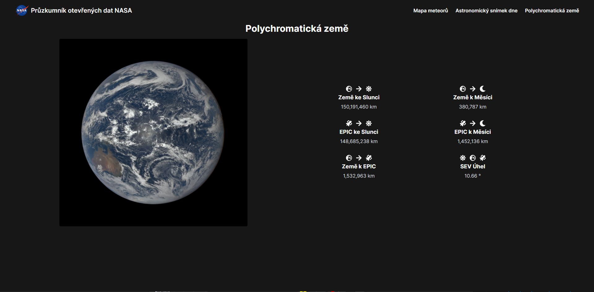

# Průzkumník otevřených dat NASA

<p align="center">
  
  
</p>
<p align="center">
  
  
</p>

## Installation

#### 1. Clone the GitHub repository:
```bash
git clone https://github.com/Jakooob14/hackithon-websteri/
```

#### 2. Run the development server:
```bash
npm run dev
# or
yarn dev
# or
pnpm dev
# or
bun dev
```

Open [http://localhost:3000](http://localhost:3000) with your browser to see the result.